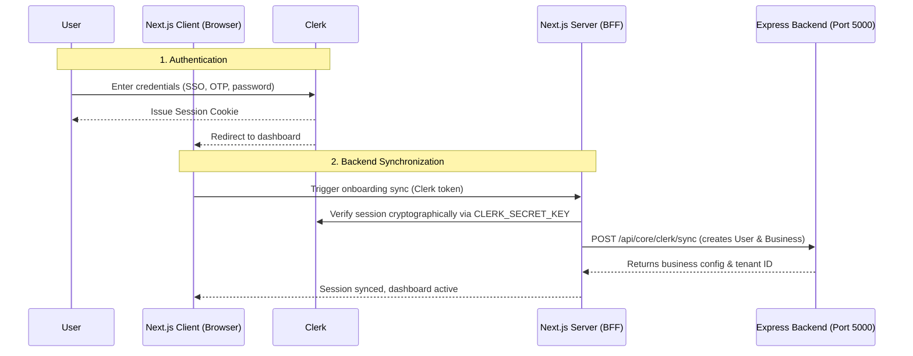

# Project Name: Multi-Vertical WhatsApp Automation SaaS (Frontend)

## 1. Project Overview & Role

**Role:** Senior Frontend & React Architect.
**Project:** A modern, high-performance Next.js web application serving as the Multi-Tenant Business Dashboard and Customer Portal interface for the Textra WhatsApp Automation platform.
- **Business Dashboard:** Admin interface where businesses (Two-Wheeler Service, Car Service) manage settings, track customer lists, check WABA delivery status, and view analytics.
- **Public Customer Portal:** Obscure zero-auth interface where vehicle owners view historical digital service books, update odometer metrics, or submit early service logs.

---

## 2. Technical Stack

- **Framework:** Next.js (version 16.0.10) with React 19 (App Router).
- **Styling:** Tailwind CSS v4 with PostCSS.
- **State Management:** Redux Toolkit (`@reduxjs/toolkit` & `react-redux`).
- **Authentication:** Clerk (`@clerk/nextjs`) for business and staff admin; passwordless/session-less secure access for public portals.
- **UI Components:** Radix UI primitives & Lucide icons.
- **Forms & Validation:** React Hook Form with Zod schema verification.
- **API Client:** Axios for calling the Express.js Backend.

---

## 3. Directory Structure

```
Textra-Prod-Frontend/
├── .agents/rules/            # Rule definitions for IDE agents
│   └── project-goals.md      # This technical reference file
├── public/                   # Static assets
└── src/
    ├── app/                  # Next.js App Router (pages & layouts)
    │   ├── api/              # Local serverless endpoints (e.g., Clerk login hooks)
    │   ├── dashboard/        # Multi-tenant business dashboards
    │   ├── portal/           # Zero-auth public customer portal screens
    │   ├── layout.tsx        # Base application layout
    │   └── page.tsx          # Public landing/login pages
    ├── components/           # Reusable UI component systems (Radix/Tailwind)
    ├── store/                # Redux Toolkit global state store
    ├── middleware.ts         # Clerk routing security checks
    └── tsconfig.json         # TypeScript configurations
```

---

## 4. Authentication Architecture & BFF Pattern

The frontend employs a **Backend-For-Frontend (BFF)** hybrid pattern securely linking the client, Clerk, Next.js server, and the external Express backend:



*   **Middleware Enforcement:** `middleware.ts` intercepting incoming requests, validating cookies using `CLERK_SECRET_KEY`, and protecting private `/dashboard` directories.
*   **Public Portal Exemption:** Routes under `src/app/portal/[uid]` bypass Clerk entirely to allow passwordless access for customers updating their vehicle usage metrics.

---

## 5. Developer Rules (AI Instructions)

1.  **Strict Obscurity for Portals:** Do NOT place portal routes under Clerk protected middleware groups. Keep `/portal/[uid]` completely accessible.
2.  **API Client Scoping:** All API requests to the Express backend should utilize the configured Axios client that intercepts and attaches bearer authorization context where necessary.
3.  **Modular Styling:** Leverage Tailwind CSS v4 variables and Radix UI classes. Do not hardcode raw absolute pixel sizes or generic colors.
4.  **Companion Technical Links:**
    - **Express Backend Specs:** [Backend project-goals.md](file:///c:/Sourabh/Personal/Whatsapp/Textra/Backend/.agents/rules/project-goals.md)
    - **Global Architecture System:** [Root project-goals.md](file:///c:/Sourabh/Personal/Whatsapp/Textra/.agents/rules/project-goals.md)
