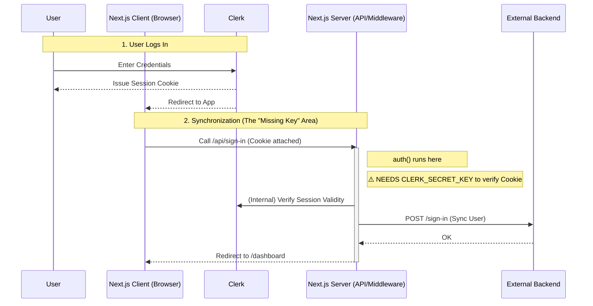

# Authentication Architecture & Data Flow

This document outlines how authentication works in your current Next.js application, specifically addressing why the **Clerk Secret Key** is required even though you have a separate backend.

## 1. The Hybrid Architecture

Your application uses a "Backend for Frontend" (BFF) pattern where Next.js serves not just as the UI renderer but also as a secure intermediate layer.

- **Client (Browser)**: Runs React, holds the User's Session Cookie.
- **Next.js Server**: Runs Middleware and API Routes (`/api/sign-in`). Acts as a **Trusted Client**.
- **Clerk**: The Identity Provider (handles passwords, OTPs, session management).
- **External Backend**: Your existing API that handles business logic (Database, WhatsApp, etc.).

## 2. Why is the Secret Key Required?

You might wonder: _"If I log in on the client, why does Next.js need a secret?"_

When a user visits your site, they hold a **Session Cookie**.

1.  **Middleware Validation**: When usage reaches `middleware.ts` (or your current `proxy.ts`), Next.js needs to verify this cookie. It uses the Secret Key to cryptographically validate that the cookie was issued by your Clerk instance and hasn't been tampered with.
2.  **API Route (`/api/sign-in`)**: Inside your API route, you call `auth()`. This runs on the Next.js **server**. To trust the request coming from the browser, it again verifies the session token using the Secret Key.

**Without the Secret Key, the Next.js server is blind.** It cannot verify if a user is truly logged in, so `auth()` returns `null` or throws an error.

## 3. The Authentication Flow diagram

## 4. Current Issues & Fixes

Based on this flow, we have two critical configuration issues preventing the app from working:

### Issue A: Missing `CLERK_SECRET_KEY`

**Symptom:** `Error: @clerk/nextjs: Missing secretKey`
**Reason:** Next.js Server cannot verify the session at step 2.
**Fix:** Add the key to `.env`.

### Issue B: Middleware Misnamed (`proxy.ts`)

**Symptom:** `GET /sign-in 404` (potentially) or Middleware not protecting routes.
**Reason:** Next.js strictly requires the middleware file to be named `middleware.ts` or `middleware.js` in the `src/` directory. It does not recognize `proxy.ts` as the application middleware.
**Fix:** Rename `src/proxy.ts` to `src/middleware.ts`.
